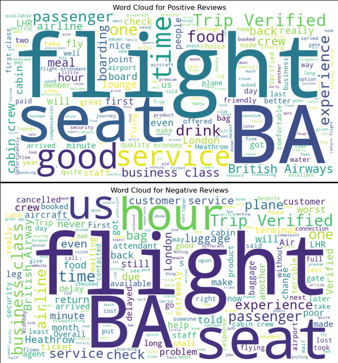
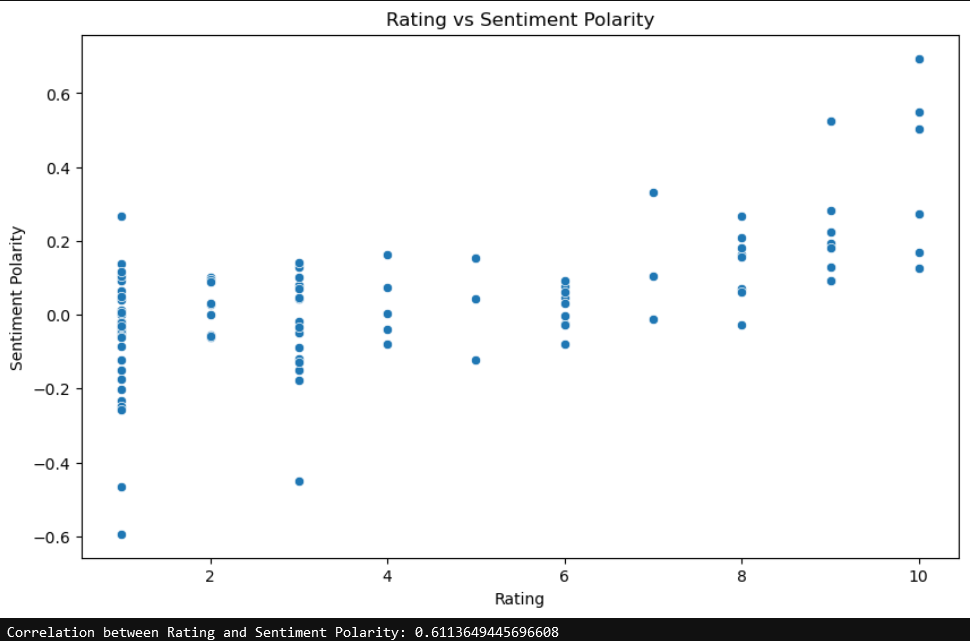

# British Airways Reviews Analysis

## Business Understanding
### The objective of this data science project is to:
<ul>
  <li>To scrape data of passenger of British Airways from Skytrax</li>
  <li>To store and analyze passenger reviews through sentiment analysis </li>
  <li>Provide insights about variability in positive and negative reviews and to understand major areas for need of improvement</li>
</ul>

 

## Data Understanding
 The datasets is obtained from the Airlines Quality Review website <a href="https://www.airlinequality.com/airline-reviews/british-airways/">Skytrax.</a> The dataset contains information about the reviews of several passengers, nearly 100, who had travelled in British Airways, along with additional details such as name, date and ratings.
Columns of the population dataset include:
<ul>
  <li><code>Passenger</code> : The name of passenger.</li>
  <li><code>Date of Publication</code> : The date of publication of review by passenger.</li>
  <li><code>Ratings</code> : The rating provided by passenger out of 10.</li>
  <li><code>Feedback</code> : The review provided by passenger.</li>
</ul>

 

## Analysis
### WordCloud of Positive and Negative Reviews

<ul>
  <li>Passengers are appreciating both good service and poor service experiences equally.</li>
  <li>Seating and Comfort are factors that contributes both satisfaction and dissatisfaction among passengers.</li>
  <li>Flight Delays and Cancellations are major contributors in negative reviews. It indicates need of punctuality regarding flight schedules.</li>
  <li>Luggage Handling and Receiving are common complaints that to be attended to improve satisfaction of passenger.</li>
  <li>On other hand, Passengers had good experience with in-flight services, friendly staff and comfortable seating, specially in business and first class.</li>
</ul>

 

### Distribution of Sentiment Polarity using TextBlob

<ul>
	<li>The positive correlation indicates that Passengers who highly rate their experience are more likely to express positive sentiments.</li>
	<li>Ratings in the range of 5-7 often indicates that passengers might have both positive and negative experiences, leads to overall average rating.</li>
	<li>Low rating reviews involves a mix of negative and neutral sentiments. It shows that low ratings could be due to specific incidents of service that negatively impacted the experience of passengers.</li>
</ul> 

## Author
### Tushar Mukherjee 

<a href="mukherjeetushar78@gmail.com">E-mail</a> || <a href="www.linkedin.com/in/tushar-mukherjee-b8516028a">LinkedIn</a> || <a href="https://github.com/GocoVoid">GitHub</a>
